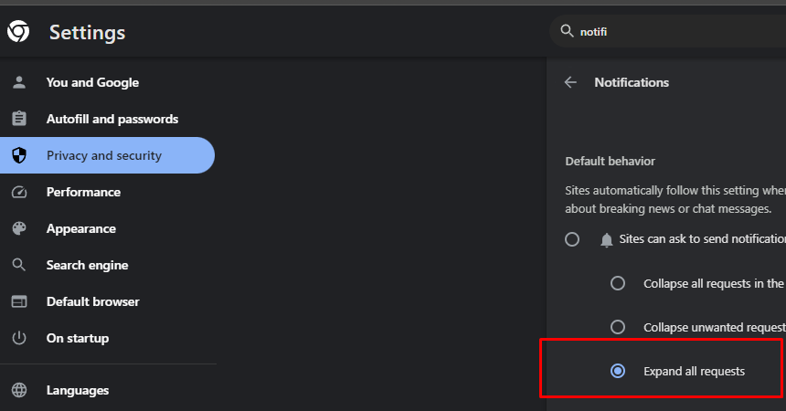
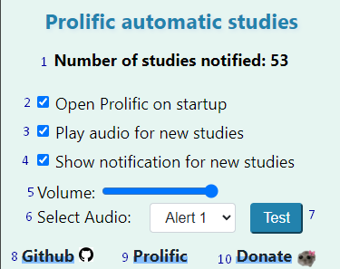

⚠️ **Note:** This repository is a fork of [spin311/ProlificAutomaticStudies](https://github.com/spin311/ProlificAutomaticStudies)  with added compatibility for **Mozilla Firefox** browsers.

Original extension was designed for Chrome only. For Chrome users, please refer to the original repository or install the extension from the Chrome Web Store.

Note: The original developer has released an official version for Firefox, install it from https://addons.mozilla.org/en-US/firefox/addon/prolific-studies-notifier/
# Prolific Studies Notifier

Welcome Prolific Studies Notifier! 

Get notified when new studies are available on [Prolific](https://app.prolific.com/).
Extension works by notifying when Prolific tab title changes, so [Prolific](https://app.prolific.com/) tab must be opened for the extension to work.

If you like the extension, please give it a star on GitHub! 

## Support Our Efforts

Donations help me make tools like this for free in my spare time. Any amount helps! ❤️

## Enabling Notifications

For notifications to work, you must enable them on your browser AND on your system.

## How to use the extension:

1. Number of studies this extension has notified you.
2. Open Prolific when opening browser.
3. Option to play audio sound chosen below when new study is available.
4. Option to show a notification when new study is available.
5. Select audio volume.
6. Select audio sound from a list.
7. Test sound and notification.
8. [GitHub page for extension](https://github.com/spin311/ProlificAutomaticStudies)
9. Open Prolific website.
10. [Donate with PayPal or any credit card](https://www.paypal.com/donate/?hosted_button_id=4WXEWMN3QGLGY)

Make sure to pin the extension.

## Contact

If you have any suggestions or questions, you can contact me at [spin311pro@gmail.com](mailto:spin311pro@gmail.com)

Enjoy 😊

# Firefox

This Firefox version currently lacks some features from the original Chrome extension, including the full extension interface functionality.

The main feature—getting notified of new studies on the Prolific dashboard via tab name changes—works most of the time, but it can be unreliable occasionally.

Installation

1. Under Releases, download ProlificAutomaticStudies_firefox.zip and save it to a location you prefer.

2. Extract the ZIP file to a folder.

3. Open Firefox and go to about:debugging#/runtime/this-firefox.

4. Click the “Add Temporary Extension” button.

5. Navigate to the extracted folder and select the manifest.json file.

Note: Since this is an experimental, temporary extension, you’ll need to reload it every time Firefox restarts, and the notifications may not always trigger as expected.

